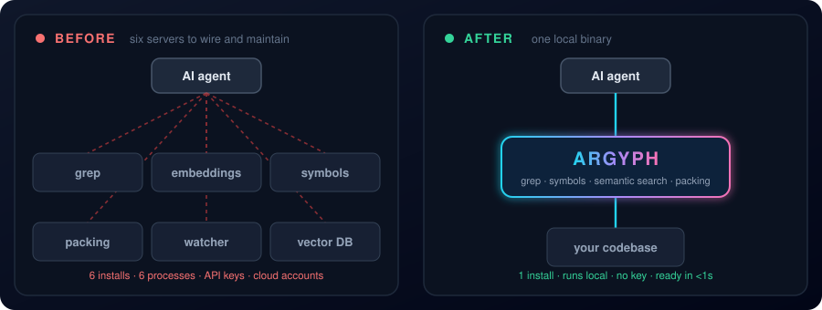
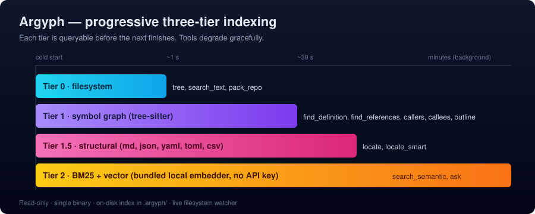

<div align="center">


<br/>

[](https://github.com/Ezzy1630/argyph/actions/workflows/ci.yml)
[](https://crates.io/crates/argyph)
[](https://www.npmjs.com/package/argyph)
[](https://github.com/Ezzy1630/argyph/releases)
[](https://github.com/Ezzy1630/homebrew-argyph)

**Stop wiring six MCP servers.** Argyph is one local binary that gives your AI coding agent grep, a symbol graph, and semantic search over any repo — indexed in under a second, with no API key.

[Install](#-install) · [Quick start](#-quick-start) · [How it works](#-how-it-works) · [Tools](#-tools) · [Architecture](ARCHITECTURE.md) · [Roadmap](ROADMAP.md)

<br/>



⭐ If this looks useful, a star helps others find it.

</div>

---

Most developers stitch together a half-dozen MCP servers to give an AI agent context over a codebase — one for grep, one for embeddings, one for symbol search, one for repo packing. Each is a separate install, a separate process, and (often) a separate cloud account. Argyph replaces all of them with a single local binary. It indexes incrementally and is ready in under a second on previously-indexed repos — no daemon, no account, no API key.

> The name is a portmanteau of **Argus** (the hundred-eyed watcher of Greek myth) and **Glyph** (a carved symbol with bound meaning) — a server that watches a codebase and gives the agent its symbols.

## ✨ What it does

Argyph exposes three pillars of context behind one MCP endpoint:

| Pillar | What you get |
|--------|--------------|
| 🧭 **Ask-first retrieval** | `ask` is the primary agent-facing lookup tool. It routes bare identifiers to symbol search, structured locators to `locate`, and natural-language questions to hybrid search — returning bounded `Span` results instead of whole files. |
| 🔗 **File & symbol intelligence** | A tree-sitter-driven symbol graph with `find_definition`, `find_references`, callers, callees, imports, and outline tools. Structural queries return in milliseconds. |
| 🧠 **Semantic search** | Hybrid (BM25 + vector) search over AST-aware chunks, backed by an embedded LanceDB store. A bundled local embedding model means no API key is required for full functionality. |
| 📦 **Repo packing** | Token-budgeted, repomix-style flattening of a repo or subset for agents that need to absorb a codebase quickly. |

> [!NOTE]
> Everything is **read-only**. Argyph never edits, commits, or executes code.

**Local-first by design.** Every tier runs on the developer's machine — your proprietary code never touches a cloud vector DB or a remote embedding API, and a bundled embedding model means full functionality with zero keys.

<details>
<summary><b>Why local-first?</b></summary>

<br/>

Most existing context servers depend on a cloud vector database (Milvus, Pinecone) and a remote embedding API. That's a non-starter for proprietary code at most companies, and a tax on cold starts everywhere else.

Argyph runs entirely on the developer's machine: a single binary, an embedded vector store, an optional bundled embedding model — no daemon, no account, no key required to get full functionality.

</details>

## 📥 Install

> Current release: **`v1.0.4`** — published on npm, crates.io, the Homebrew tap, and as prebuilt GitHub-release binaries.

**Claude Code** (recommended):

```bash
claude mcp add argyph -- npx argyph@latest
```

**npm / npx:**

```bash
npx argyph
```

<details>
<summary><b>More install methods</b> — Homebrew · universal installer · Cargo · source · Claude Desktop</summary>

<br/>

### Homebrew (macOS / Linux)

```bash
brew install Ezzy1630/argyph/argyph
```

### Universal installer

```bash
curl -fsSL https://raw.githubusercontent.com/Ezzy1630/argyph/main/scripts/install.sh | bash
```

> **Intel Mac (`x86_64-apple-darwin`) users:** the ONNX Runtime backend
> doesn't ship a prebuilt for Intel macOS, so no prebuilt binary is
> produced for that target. Use the **Cargo** path below — it builds
> in a couple of minutes and works fine on Intel Macs.

### Cargo

`cargo install argyph` builds Argyph from source. Requires a **Rust
toolchain ≥ 1.88** (`rustup update`). The bundled local embedder uses
[`ort`](https://crates.io/crates/ort) (ONNX Runtime); on most
platforms `ort` ships a prebuilt dynamic library and there is nothing
to do. On Linux you may need `libssl-dev` and a working C toolchain;
on Windows the MSVC build tools are required. If the build fails on
`ort-sys` linkage, set `ORT_STRATEGY=download` before re-running.

```bash
cargo install argyph --locked
```

### Build from source

```bash
git clone https://github.com/Ezzy1630/argyph.git
cd argyph
cargo build --release
./target/release/argyph serve
```

### Claude Desktop (DXT)

Download `argyph.dxt` from the [latest release](https://github.com/Ezzy1630/argyph/releases/latest) and double-click.

</details>

## 🚀 Quick start

```bash
# In any repo
cd ~/code/your-repo
argyph init
claude mcp add argyph -- npx argyph@latest
claude
```

In the chat:

> *What does this codebase do, and where is session expiration controlled?*

Behind the scenes the agent calls `ask`, and Argyph returns bounded spans — not whole files — so the agent reads only what matters:

```json
{
  "spans": [
    {
      "file": "src/auth/session.rs",
      "start_line": 41,
      "end_line": 55,
      "text": "fn is_expired(&self, now: Instant) -> bool { ... }",
      "kind": "definition",
      "symbol": "is_expired",
      "language": "rust"
    }
  ],
  "strategy_used": "definition"
}
```

Argyph indexes Tier 0 in under a second on first run, Tier 1 (symbol graph) in seconds, and Tier 2 (embeddings) in the background. You can query immediately — tools return what's available now plus an `index_coverage` field so the agent knows.

## ⚙️ How it works



Argyph builds the index in three tiers, each useful before the next completes:

| Tier | What it builds                                | Time on a 1M-LOC repo | Useful for                              |
|:----:|-----------------------------------------------|:---------------------:|------------------------------------------|
| 0    | File inventory, hashes, .gitignore-aware tree | <1 s                  | Tree views, ripgrep, packing             |
| 1    | Symbol graph (defs, refs, calls, imports)     | ~30 s                 | Go-to-def, find-references, call graphs  |
| 1.5  | Structural index (non-code: md, json, yaml…)  | seconds (after Tier 1)| `locate` for structured non-code files   |
| 2    | Embeddings + hybrid index                     | minutes (background)  | Fuzzy semantic queries                   |

The 80/20 insight: most agent queries are structural (`where is parseConfig defined?`, `what calls validateUser?`) and don't need embeddings. Argyph serves those from Tier 1 in milliseconds, even while Tier 2 is still building.

After the first index, the on-disk `.argyph/` directory persists and only changed files are reprocessed on subsequent runs. A filesystem watcher keeps everything live.

## 🧰 Tools

<details open>
<summary><b>19 tools across 4 tiers</b></summary>

<br/>

| Tool                  | Description                                              | Tier required |
|-----------------------|----------------------------------------------------------|:-------------:|
| `ask`                 | Primary lookup router returning bounded spans            | 0/1/1.5/2     |
| `get_index_status`    | Tier readiness, embedding progress, watcher state        | 0             |
| `get_repo_overview`   | Languages, entry points, README excerpt, tree            | 0             |
| `search_text`         | Ripgrep-style regex / literal search                     | 0             |
| `find_definition`     | Locate the definition of a named symbol                  | 1             |
| `find_references`     | Reference sites with surrounding context                 | 1             |
| `get_callers`         | Functions that call a given function                     | 1             |
| `get_callees`         | Functions a given function calls                         | 1             |
| `get_imports`         | Imports of a file, and files that import it              | 1             |
| `get_symbol_outline`  | Hierarchical outline of a file                           | 1             |
| `search_semantic`     | Hybrid BM25 + vector over AST-aware chunks               | 2             |
| `pack_repo`           | Token-budgeted repo flattening (XML or markdown)         | 0+1           |
| `locate`              | Smallest natural span containing the target              | 1.5           |
| `locate_smart`        | Retrieval subagent (opt-in; needs provider config)       | 1.5           |
| `expand_span`         | Expand one truncated span from a session handle          | 0             |
| `memory_save`         | Persist a memory entry under a scope                     | 0             |
| `memory_search`       | FTS5 search over persistent memories                     | 0             |
| `memory_list`         | List memories in a scope                                 | 0             |
| `memory_forget`       | Delete a memory entry by id                              | 0             |

Full schema reference: [docs/tools-reference.md](docs/tools-reference.md).

</details>

<details>
<summary><b>Optional: <code>locate_smart</code> — retrieval subagent</b></summary>

<br/>

`locate_smart` is an opt-in tool that runs a bounded multi-step retrieval loop using an LLM provider. It's **disabled by default**; enable it in `.argyph/config.toml`:

```toml
[locate_smart]
enabled  = true
provider = "openai"        # or "anthropic" | "ollama"
model    = "gpt-4o-mini"
# endpoint = "http://localhost:11434"   # only for local providers
```

Or via env:

```bash
ARGYPH_LOCATE_SMART_ENABLED=1
ARGYPH_LOCATE_SMART_PROVIDER=anthropic
ARGYPH_LOCATE_SMART_MODEL=claude-haiku-4-5
```

When disabled, calls to `locate_smart` return `LOCATE_SMART_DISABLED` immediately and no provider keys are required.

Build with the smart feature:

```bash
cargo install argyph --features smart
```

</details>

<details>
<summary><b>Configuration</b></summary>

<br/>

Config is layered (highest priority first): env vars, `.argyph/config.toml` in the repo, built-in defaults. A config file is never required.

```bash
ARGYPH_LOG=info
ARGYPH_EMBED_PROVIDER=local        # local | openai | voyage
OPENAI_API_KEY=...                 # standard provider env vars
ARGYPH_DISABLE_WATCHER=true        # for sandboxed environments
```

Install agent lookup instructions in `CLAUDE.md`, `AGENTS.md`, or `GEMINI.md`:

```bash
argyph init
```

</details>

## 🆚 Why Argyph (vs alternatives)

| Tool                        | Symbol graph | Semantic search | Local-first | Single install | Incremental |
|-----------------------------|:------------:|:---------------:|:-----------:|:--------------:|:-----------:|
| claude-context (Zilliz)     |      —       |       ✅        |     —       |       ✅       |     ✅      |
| GitNexus / CodeGraphContext |      ✅      |       —         |     —       |       —        |     —       |
| repomix                     |      —       |       —         |     ✅      |       ✅       |     —       |
| Serena                      |      ✅      |       —         |     ✅      |       ✅       |     —       |
| **Argyph**                  |    **✅**    |     **✅**      |   **✅**    |     **✅**     |   **✅**    |

> Argyph is the only one that's all five — symbol graph **and** semantic search, local-first, one install, incremental.

## 📊 Benchmarks

Full methodology and reproduction steps are in [`docs/benchmarks.md`](docs/benchmarks.md) — reproduce locally with `cargo bench --workspace`. Numbers below are the median of three runs on the reference hardware tagged `m4-air` (Apple M4 MacBook Air, 16 GB RAM, macOS 26) unless stated otherwise.

| Fixture                              | Files  | LOC    | Tier 0 cold | Tier 1 full |
|--------------------------------------|-------:|-------:|------------:|------------:|
| `BurntSushi/ripgrep`                 |    215 |   ~52K |    **71 ms**|   **6.8 s** |
| `microsoft/TypeScript` (`src/`)      |    709 |  ~452K |    **30 ms**|   **8.2 s** |
| `microsoft/TypeScript` (whole repo)  | 81,310 |    ~2M |   **2.1 s** | see note ↓  |

<details>
<summary><b>Hot-path micro-benchmarks & large-monorepo notes</b></summary>

<br/>

### Hot paths (criterion, mean times)

| Bench                       | Mean      | What it measures                              |
|-----------------------------|-----------|------------------------------------------------|
| `locate_parse_path_bare`    | ~15 ns    | Parsing a bare path locator                    |
| `locate_parse_path_heading` | ~18 ns    | Parsing `path > Heading` locators              |
| `locate_strategy_path_only` | ~19 ns    | Strategy dispatch for path-only locator        |
| `locate_strategy_scoped`    | ~32 ns    | Strategy dispatch for scoped query locator     |
| `token_count_rust_file`     | ~4.4 µs   | `cl100k_base` tokenization of one source file  |
| `walk_project_root`         | ~244 ms   | Full `walkdir` traversal of this repo          |

### System-level

Reproduce via:

```bash
cargo run --release -p argyph-benches --bin system_bench -- /path/to/repo
```

**Tier 0 — the "useful immediately" gate — scales linearly and fast**
(81K files in 2.1 s). `search_text` and `pack_repo` are available the
moment Tier 0 is ready.

**Tier 1 (the symbol graph) is fast on normal-to-large repos.** Two
optimizations landed for v1.0: the within-file reference resolver was
rewritten from an O(symbols²) substring scan to one-pass hash-indexed
lookups (4.2× — TypeScript compiler source: 34.6 s → 8.2 s), and the
per-file symbol/chunk SQL writes are now batched. On *very* large
monorepos (the full 81K-file TypeScript repo, ~2M LOC) Tier 1 still
does not finish within 30 min — the residual cost is raw tree-sitter
parse volume across 79K files, which needs streaming/parallel indexing
(tracked in [ROADMAP.md](ROADMAP.md)). The server never blocks at any
scale: Tier-1 tools return `INDEX_NOT_READY` with a retry hint until
the graph is ready. Full data: [`docs/benchmarks.md`](docs/benchmarks.md).

</details>

## 🏗️ Architecture

Argyph is a Rust workspace of twelve focused crates with strict module ownership. The full architecture — including the Supervisor lifecycle, the three-tier indexing model, and per-crate responsibility boundaries — is documented in [ARCHITECTURE.md](ARCHITECTURE.md).

## 📦 Project status

**Stable.** `v1.0.x` is published on all channels. Active development continues against the milestones at the top of [ROADMAP.md](ROADMAP.md); the build plan is in [`docs/BUILD_PLAN.md`](docs/BUILD_PLAN.md).

## 🤝 Contributing

Argyph is built with substantial AI assistance, but human-architected and human-reviewed. Contribution guide and the (strict) AI agent rules are in [CONTRIBUTING.md](CONTRIBUTING.md). Commit conventions, including the project's attribution policy, are in [`docs/COMMIT_CONVENTIONS.md`](docs/COMMIT_CONVENTIONS.md).

## 👤 Author

Built by [Ezzy1630](https://github.com/Ezzy1630). See [AUTHORS.md](AUTHORS.md).

## 📄 License

[](#-license)
[](#cargo)

Dual-licensed under either of:

- MIT License ([LICENSE-MIT](LICENSE-MIT))
- Apache License 2.0 ([LICENSE-APACHE](LICENSE-APACHE))

at your option.
